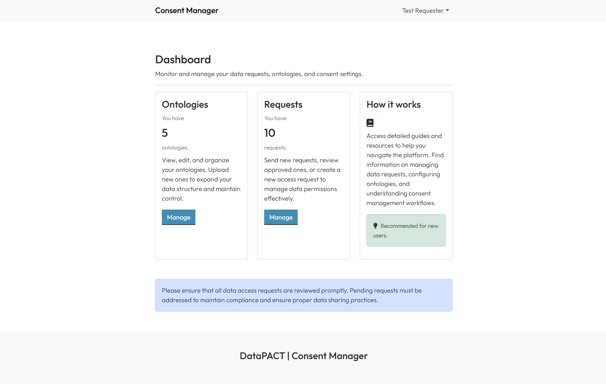

# Consent Manager

Powered by

[](https://dips.soton.ac.uk/#home)


## **General Description**

The Consent Manger provides an interface and API to manage consent requests. Requesters can create consent requests based on ODRL Policies, and customised using domain specific terminology (through ontology files). Consent requests can be sent to users who can accept them, reject them. They have the ability to revoke them later.





## **Commercial Information**


| Organisation (s) | License Nature | License |
| ---------------  | -------------- | ------- |
| University of Southampton  | Open Source | MIT Licence |


## **Top Features**

* Requesters can create consent requests based on ODRL policies.​
* Requesters can send consent requests to data owners identified by their email address.​
* Requesters can keep track of who has approved or rejected their requests, and download the relevant consent forms.​
* Data owners can view, approve, reject and revoke consent requests.​

## **How To Install**

### Requirements

Download and install [Node.js](https://nodejs.org/en)

### Software

React, Firebase

### Summary of installation steps

1. **Clone the project:**

```bash
  git clone https://github.com/EU-UPCAST/upconsent.git
```

2. **Navigate into the project directory:**

```bash
  cd upconsent
```

3. **Install the required libraries**

```bash
  npm install
```

> **Note:** Mac users: If you face permission errors, you might need **sudo npm install**.

4. **Start the development server:**

```bash
  npm run dev
```

> **Note:** Mac users: If you face permission errors, you might need **sudo npm run dev**.

5. **Open the project in your browser:**

- Once the server starts, a localhost URL (usually http://localhost:3000) will be shown in the terminal.
- Press Ctrl + Click on the URL or copy and paste it into your browser.

The project should now be running locally.

## Expected KPIs


| What | How | Values |
| --- | --- | --- |
| 1) Engagement and satisfaction with consent manager  2) Scalability of reviewing stored consent | 1) Questionnaire for users of the consent manager (or pilots that are testing it, if the consent manager has not been deployed yet to a sufficient amount of users)  2) Experiment with synthetic data, and policies with 5 different permissions. | 1) ≥5/7 Likert scale rating in user satisfaction with usability of the tool, the ease to accept and/or revoke consent, and the ease to understand the policy clauses. 2) computing, based on the stored data on agred/revoked consents, which subset of a batch of 1000 users provided their consent to a complete policy (this should be computed in under a second), and which ones to a particular subset of permissions for a policy (this should be computed in under 5 seconds). |
